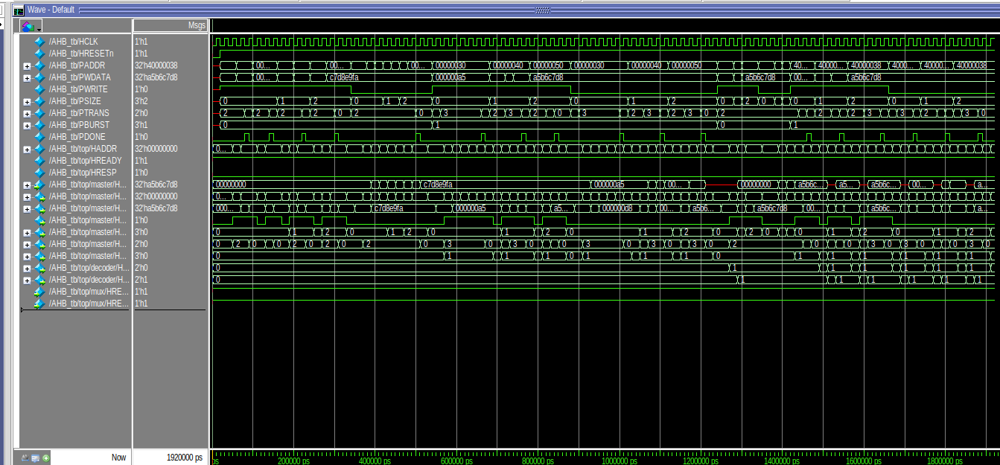
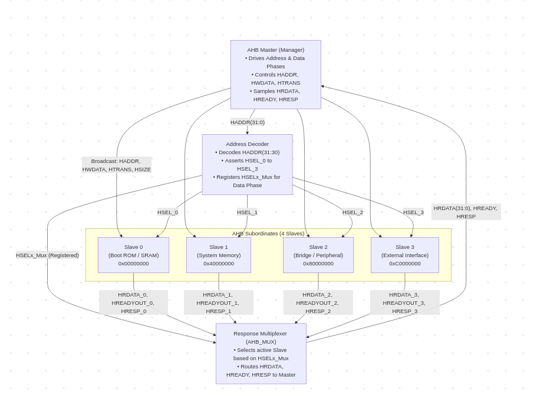

# AMBA AHB-Lite Bus Protocol System Design & Verification

## Overview

This repository contains the design, implementation, debugging, and verification of an **AMBA AHB-Lite (Advanced High-performance Bus)** subsystem in Verilog HDL.

The implementation features a pipelined Master, a centralized Address Decoder, a response multiplexer (`AHB_MUX`), and multiple parameterized memory-mapped Slave targets.

The bus supports single and burst transfers with dynamic byte-lane packing and wait-state handling.

---

## Directory Structure

```text
├── AHB_TOP.v               # Top-level interconnect wrapper
├── AHB_Lite_Master.v       # Pipelined AHB-Lite bus master module
├── AHB_Decoder.v           # Centralized address decoder & MUX selector
├── AHB_MUX.v               # Response multiplexer for slave routing
├── AHB_Slave_1.v           # 1024-byte SRAM memory slave (0x00000000)
├── AHB_Slave_2.v           # 64-byte scratchpad memory slave (0x40000000)
├── AHB_tb.v                # Comprehensive system testbench
├── waveform.png            # QuestaSim simulation waveform verification
└── architecture.png        # System architecture block diagram
```

---

# Protocol Violations Identified & Corrected

## 1. Decoder & MUX Pipelining Hazard

* **Issue:** In the original design, the multiplexer select signal (`HSELx_Mux`) was driven combinationally from the address phase. When consecutive transfers targeted different slaves, the MUX switched prematurely before the previous slave could complete its data phase.
* **Fix:** Registered `HSELx_Mux` inside `AHB_Decoder.v` gated with `HREADY`, aligning the MUX routing specifically with the data phase.

---

## 2. Master State Stalling on Wait States

* **Issue:** The master FSM and output registers changed state on every clock cycle regardless of `HREADY`, violating the protocol when slaves inserted wait states and risking early progression.
* **Fix:** Gated all master state machine transitions, address increments, and data-phase updates strictly with `if (HREADY)`.

---

## 3. Slave Selection Latching

* **Issue:** Slaves checked the instantaneous address-phase select line (`HSELx_slaves`) during the data phase. When the master moved to a different slave in the subsequent cycle, the active slave aborted the ongoing write.
* **Fix:** Added `HSEL_reg` in each slave module to sample `HSELx_slaves` during the address phase and execute write/read operations during the data phase.

---

## 4. Slave 2 FSM Read Latency & Simulation X-State Bug

* **Issue:** In `AHB_Slave_2.v`, the read data evaluation was coupled to `curr_state == READ`. The 1-cycle FSM state transition delay left `HRDATA` unassigned during the first cycle of a read, driving `32'hxxxxxxxx` in the waveform. Additionally, uninitialized memory elements generated uninitialized simulation values.
* **Fix:** Eliminated the FSM delay by driving `HRDATA` through immediate combinational decoding when selected for read, and initialized memory arrays to `8'h00` on reset.

---

## 5. Slave 2 16-bit Read Address Indexing Bug

* **Issue:** In `AHB_Slave_2.v`, the read operation indexed `memory_2[HADDR[29:0]]`. Because `memory_2` has a depth of 64 entries and requires a 6-bit index (`[5:0]`), a 30-bit index caused out-of-bounds simulation behavior.
* **Fix:** Corrected the indexing to registered `HADDR_reg[5:0]` for writes and `HADDR[5:0]` for reads.

---

## 6. Inferred Latches in Combinational Address Blocks

* **Issue:** Sub-address calculation blocks in both slaves evaluated conditionally on `HREADY` without complete default assignments, causing synthesis tools to infer unwanted transparent latches.
* **Fix:** Added complete default assignments (`HADDR_Half = 0`, `HADDR_Full_x = 0`) outside conditional branches in combinational blocks.

---

## 7. Unmapped Address Error Deadlock

* **Issue:** Accessing invalid addresses caused the MUX to default to `HREADY = 0` indefinitely, resulting in a permanent bus deadlock.
* **Fix:** Implemented a standard default error response FSM in `AHB_MUX.v` that drives `HREADY = 1` and `HRESP = 1` across unmapped regions.

---

# Protocol Verification & Test Scenarios

The verification suite (`AHB_tb.v`) exercises the protocol across diverse operating conditions.

---

## 1. Single Write Transfer (Zero Wait-State)

* **Target:** Slave 1 (`0x00000001`, `0x00000010`, `0x00000020`)
* **Control:** `PWRITE = 1`, `PTRANS = 2'b10 (NONSEQ)`, `PBURST = 3'b000 (SINGLE)`
* **Data Sizes Tested:** 8-bit (`0xA5`), 16-bit (`0xA5B6`), 32-bit (`0xA5B6C7D8`)
* **Outcome:** Data is stored across corresponding byte lanes with precise single-cycle address and data phase alignment.

---

## 2. Single Read Transfer (Zero Wait-State)

* **Target:** Slave 1 previously written addresses
* **Control:** `PWRITE = 0`, `PTRANS = 2'b10 (NONSEQ)`, `PBURST = 3'b000 (SINGLE)`
* **Outcome:** `HRDATA` returns expected byte (`0x000000A5`), halfword (`0x0000A5B6`), and word (`0xA5B6C7D8`) data cleanly without X-states.

---

## 3. Write Transfers with Wait-State Insertion

* **Target:** Slave transactions experiencing stall cycles
* **Control:** Slave deasserts `HREADYOUT`; master and slaves hold pipeline stages when `HREADY = 0`.
* **Outcome:** Pipelined control and address signals remain stable throughout wait states without data corruption.

---

## 4. Burst Transfers (INCR / Sequential Mode)

* **Target:** Sequential memory blocks in Slave 1 (`0x00000030`, `0x00000040`, `0x00000050`) and Slave 2 (`0x40000028`, `0x40000032`, `0x40000038`)
* **Control:** Initial beat `PTRANS = 2'b10 (NONSEQ)`, `PBURST = 3'b001 (INCR)`; subsequent beats `PTRANS = 2'b11 (SEQ)`
* **Outcome:** Master auto-increments `HADDR` by transfer size (+1 for byte, +2 for halfword, +4 for word). All beats are written and verified sequentially.

---

## 5. Address Decoding & Boundary Routing

* **Target:** Address transitions across slave boundaries (`0x00000000` vs `0x40000000`)
* **Control:** Decoder dynamically updates `HSELx` lines based on `HADDR[31:30]`.
* **Outcome:** MUX routes responses seamlessly between Slave 1 and Slave 2; unmapped regions maintain safe bus conditions.

---

# Simulation & Waveforms

The AHB-Lite subsystem was functionally verified using **QuestaSim**.

The testbench verifies:

* Single read and write transfers
* Byte, halfword, and word transfers
* Burst transfers
* Sequential address generation
* Wait-state handling
* Slave selection
* Address decoding
* Response multiplexing
* Unmapped address error handling
* Correct `HRDATA` generation

### QuestaSim Simulation Waveform



---

# System Architecture Diagram

## 4-Slave AHB-Lite Subsystem



### Architectural Flow & Decoding Logic

* **AHB Master (Manager):** Initiates transfers and drives address/control parameters on `HADDR`, `HTRANS`, `HSIZE`, `HBURST`, and buffers data on `HWDATA`.

* **Address Decoder:** Centrally decodes `HADDR[31:30]` to generate point-to-point chip selects (`HSEL_0` to `HSEL_3`) and provides a registered `HSELx_Mux` selector for the data phase.

* **Slave Endpoints (0 to 3):** Memory and peripheral units that sample transactions when their dedicated `HSELx` is high and `HREADY` is asserted.

* **Response Multiplexer (`AHB_MUX`):** Evaluates `HSELx_Mux` to return the active slave's `HRDATA`, `HREADYOUT`, and `HRESP` back to the bus master.

---

# High-Speed and Low-Speed SoC Peripherals

## 1. High-Speed Peripherals

### DDR Memory Controller (DDR4/5, LPDDR5)

* **Data Rate:** Multi-gigabytes per second (GB/s) throughput with several Gbps per pin.
* **Bus Interface:** High-performance multi-channel AXI4 / AXI5 buses.
* **Application:** Provides the primary system memory interface for high-bandwidth CPU, GPU, and NPU instruction/data buffering.

### Direct Memory Access (DMA) Engine

* **Data Rate:** Hundreds of MB/s to several GB/s depending on memory bus width.
* **Bus Interface:** Dual-port AHB-Lite or AXI Master/Slave interface.
* **Application:** Offloads bulk data movement between memory and I/O endpoints without stalling CPU processing cores.

### PCI Express (PCIe) Controller (Gen 4/5)

* **Data Rate:** 16 GT/s to 32 GT/s per lane.
* **Configuration:** Scalable up to x16 configurations.
* **Bus Interface:** Wide 128/256/512-bit AXI Stream / AXI Memory Mapped.
* **Application:** Connects high-throughput expansion components like NVMe SSDs, discrete GPUs, and FPGA accelerators.

### Gigabit Ethernet MAC (1G / 10G / 100G)

* **Data Rate:** 1 Gbps to 100 Gbps network bandwidth.
* **Bus Interface:** AXI4-Stream for streaming packets and AHB/AXI-Lite for configuration registers.
* **Application:** High-speed network connectivity, server packet routing, and real-time telecom processing.

### USB 3.0 / USB4 Controller

* **Data Rate:** 5 Gbps (USB 3.0) up to 40 Gbps (USB4).
* **Bus Interface:** AXI4 Memory Mapped / AXI4-Stream with integrated DMA.
* **Application:** Interfacing external high-speed storage drives, video capture units, and multi-protocol display bridges.

---

## 2. Low-Speed Peripherals

### Universal Asynchronous Receiver-Transmitter (UART)

* **Data Rate:** 9.6 kbps up to 1–3 Mbps using standard baud rates.
* **Bus Interface:** APB (Advanced Peripheral Bus).
* **Application:** Serial debugging, command-line console communication, and terminal logging interfaces.

### Inter-Integrated Circuit (I2C) Controller

* **Data Rate:** Standard Mode (100 kbps), Fast Mode (400 kbps), High-Speed Mode (up to 3.4 Mbps).
* **Bus Interface:** APB.
* **Application:** Two-wire communication with on-board sensors, temperature monitors, power management ICs (PMICs), and EEPROMs.

### Serial Peripheral Interface (SPI) Master

* **Data Rate:** 1 Mbps to 50 Mbps.
* **Bus Interface:** APB.
* **Application:** Interfacing external Serial NOR Flash, micro-displays, and analog-to-digital converters (ADCs).

### General-Purpose Input/Output (GPIO) Controller

* **Data Rate:** Static switching from tens of kHz to a few MHz.
* **Bus Interface:** APB.
* **Application:** Reading physical push-buttons, controlling board LEDs, asserting reset lines, and basic board-level handshaking.

### Watchdog Timer (WDT) / General Purpose Timers

* **Data Rate:** Few kHz to standard clock frequency ticks.
* **Bus Interface:** APB.
* **Application:** System hang detection, automatic processor resets on firmware lockups, and event scheduling.

---

# Conclusion

This project provided hands-on experience in designing and verifying a complete **AMBA AHB-Lite subsystem** at the RTL level.

The implementation focused not only on functional operation but also on identifying and correcting practical protocol-level issues involving **pipelining, wait states, slave selection, memory addressing, combinational logic, and error handling**.

The project demonstrates the complete workflow of:

**RTL Design → Debugging → Simulation → Protocol Verification**

---

## Repository Contents

```text
AMBA-AHB-Lite/
│
├── AHB_TOP.v
├── AHB_Lite_Master.v
├── AHB_Decoder.v
├── AHB_MUX.v
├── AHB_Slave_1.v
├── AHB_Slave_2.v
├── AHB_tb.v
├── waveform.png
├── architecture.png
└── README.md
```

