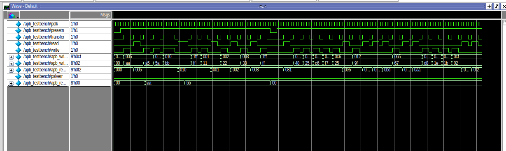

# AMBA APB Protocol Implementation & Verification

## Overview
This repository contains the Verilog implementation and testbench verification of the **AMBA APB (Advanced Peripheral Bus)** protocol. The design includes an APB Master interfaced with dual 256-byte APB Slaves.

---

## Features
- **Master-Slave Architecture:** APB Master with address decoding for two memory-mapped slaves.
- **Transfer Types:** Supports basic read/write, wait states, burst transfers, and error detection (`pslverr`).
- **FSM Control:** 3-state master operation (`IDLE`, `SETUP`, `ENABLE`).

---

## Verification Test Cases
The testbench (`apb_testbench.v`) validates the protocol across 10 functional cases[cite: 2]:
1. **TC1:** Basic Write Operation (`9'h005`, `8'hAA`)
2. **TC2:** Basic Read Operation (`9'h005` -> `8'hAA`)
3. **TC3:** Slave Select & Address Decoding (`psel1` / `psel2`)
4. **TC4 & TC5:** Write & Read with Wait States (`9'h010`, `8'hBB`)
5. **TC6 & TC8:** Out-of-Range Access & Error Flagging (`pslverr` on `9'h1FF`)
6. **TC7:** Burst Transfers (`9'h001` - `9'h003`)
7. **TC9:** Asynchronous System Reset
8. **TC10:** Randomized Stress Transactions

---

## Simulation Waveform

### Waveform Analysis:
- **Write/Read Execution:** Shows `transfer` asserted with corresponding `write`/`read` control lines, latching addresses and streaming data to `apb_read_data_out`[cite: 1, 2].
- **Error Response:** Highlights `pslverr` assertion during invalid address access (`9'h1FF`)[cite: 2].
- **Stress & Reset:** Captures back-to-back randomized transfers and active-low `presetn` reset recovery[cite: 2].

---

