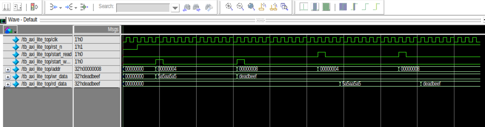

# AMBA AXI-Lite Protocol Implementation & Verification

## Overview
This repository contains the Verilog RTL design and testbench verification of the **AMBA AXI-Lite Protocol** (Industrial Protocols Lab 03). The design implements an AXI-Lite Master and Slave architecture with a 256 x 32-bit internal memory array across 5 dedicated channels.

---

## Directory Structure
```text
├── AXI_Lite_Master.v               # AXI-Lite Master FSM & Channel Logic
├── AXI_Lite_Slave.v                # AXI-Lite Slave Memory & Handshake Controller
├── AXI_Lite_Top.v                  # Top-Level Interconnect
├── TB_AXI_Lite_Top.v               # Verification Testbench
├── INDSUTRIAL_PROTOCOLS_LAB3.pdf   # Lab Documentation
├── axi_waveform.png                # Simulation Waveform Capture
└── README.md
```

---

## Design Specifications & FSM

Both the **Master** and **Slave** operate using synchronized 5-state Finite State Machines (FSM):
- `IDLE (3'b000)`: Quiescent state; waits for `START_WRITE`/`START_READ` (Master) or valid handshake signals (Slave).
- `RADDR_CHANNEL (3'b001)`: Drives and accepts Read Address (`ARADDR`, `ARVALID`, `ARREADY`).
- `RDATA_CHANNEL (3'b010)`: Captures read data from internal memory (`RDATA`, `RRESP`, `RVALID`, `RREADY`).
- `WRITE_CHANNEL (3'b011)`: Transfers write address and data (`AWADDR`, `WDATA`, `WSTRB`, `AWVALID`, `WVALID`).
- `WRESP_CHANNEL (3'b100)`: Evaluates write response status (`BRESP`, `BVALID`, `BREADY`).

### Slave Memory Specs:
- **Storage:** 256 x 32-bit registers (`memory[0:255]`).
- **Byte Strobes:** Full support for 4-bit write strobes (`WSTRB[3:0]`).
- **Response Code:** Default `OKAY` (`2'b00`) for both `RRESP` and `BRESP`.

---

## Verification & Transactions

The testbench (`TB_AXI_Lite_Top.v`) tests sequential write and read operations:
1. **Write Transaction 1:** Writes `32'h5A5AA5A5` to address `32'h00000004`.
2. **Write Transaction 2:** Writes `32'hDEADBEEF` to address `32'h00000008`.
3. **Read Transaction 1:** Reads from address `32'h00000004`, successfully asserting `32'h5A5AA5A5` on `rd_data`.
4. **Read Transaction 2:** Reads from address `32'h00000008`, successfully asserting `32'hDEADBEEF` on `rd_data`.

---

## Simulation Waveform




---

## 👨‍💻 Author

**Ali Irfan**

Computer Engineering | Digital IC Design & Verification

Passionate about **RTL Design, Digital IC Design, Functional Verification, FPGA Development, and ASIC Design Flows**.

Experienced with **Verilog HDL, SystemVerilog, QuestaSim, FPGA-based design, AMBA protocols, and RTL-to-GDSII workflows** using open-source ASIC tools.

This repository represents practical engineering work, hands-on learning, and continuous development in **digital hardware design and verification**.

⭐ If you find this repository useful, consider giving it a star.


---

