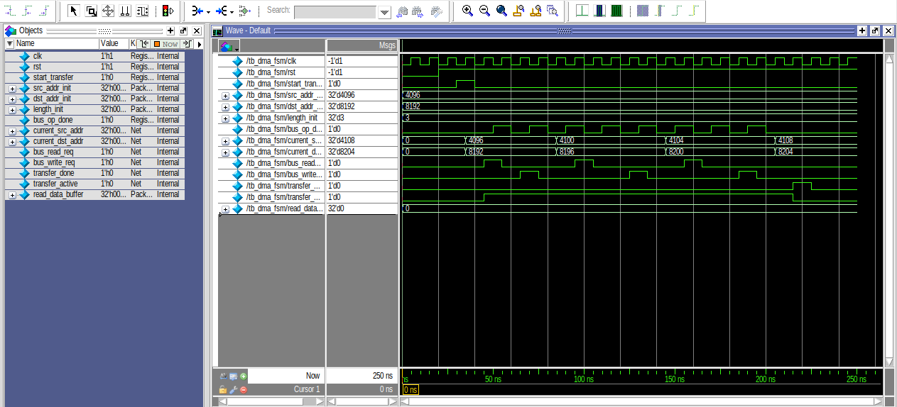
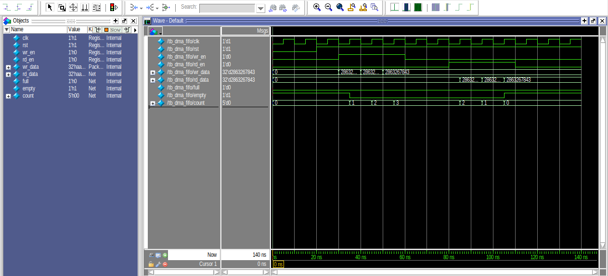
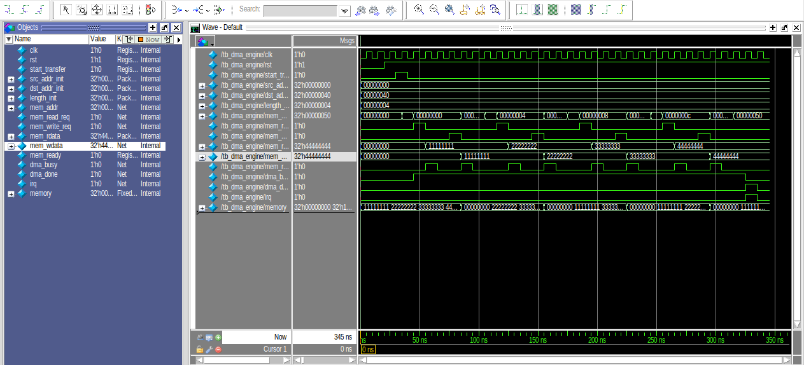

# Industry Protocols: Lab (DMA Engine Design)

## Overview
This repository contains the design, implementation, and simulation verification of a Direct Memory Access (DMA) engine in Verilog HDL. The module is configured for memory-to-memory transfers, allowing block data movement between system addresses without continuous CPU intervention.

---

## Architecture & System Design

### 1. DMA Controller Finite State Machine (`dma_fsm.v`)
The FSM orchestrates the memory transfer sequence step by step:
* **`state_idle`**: Waits for `start_transfer` to be asserted with a non-zero transfer length. Latches initial source and destination addresses.
* **`state_read`**: Drives `bus_read_req` high to request data from the current source address.
* **`state_wait_read`**: Waits for memory acknowledge/ready handshake (`bus_op_done == 1`).
* **`state_write`**: Drives `bus_write_req` high to write the buffered data to the destination address.
* **`state_wait_write`**: Waits for destination memory acknowledge/ready handshake (`bus_op_done == 1`).
* **`state_inc_addr`**: Increments source and destination pointers by 4 bytes (word alignment) and decrements the remaining word count.
* **`state_done`**: Asserts `transfer_done` for 1 clock cycle and releases `transfer_active` before returning to idle.

### 2. Synchronous FIFO Buffer (`dma_fifo.v`)
Acts as an internal temporary storage buffer between read and write bus cycles:
* Parameterized data width (32-bit) and depth (16 entries).
* Synchronous read/write pointers and element counter (`count`).
* Generates `empty` and `full` status flags to prevent underflow/overflow.

### 3. Top-Level DMA Engine (`dma_engine.v`)
Integrates the DMA FSM controller and synchronous FIFO buffer:
* Multiplexes memory address lines between source and destination pointers based on operation phase.
* Buffers incoming memory read data directly into FIFO and drives outgoing FIFO data during write operations.
* Drives system-level status flags `dma_busy`, `dma_done`, and completion interrupt request `irq`.

---

## Directory Structure

```text
├── dma_fsm.v               # FSM controller module
├── dma_fifo.v              # Synchronous FIFO buffer module
├── dma_engine.v            # Top-level DMA engine module
├── tb_dma_fsm.v            # Testbench for DMA FSM
├── tb_dma_fifo.v           # Testbench for FIFO buffer
├── tb_dma_engine.v         # Testbench for complete DMA engine
├── dma_fsm_waveform.png    # Simulation waveform of FSM
├── dma_fifo_waveform.png   # Simulation waveform of FIFO
└── dma_engine_waveform.png # Simulation waveform of complete DMA system
```

---

## Simulation & Waveforms

### Task 1: DMA FSM Controller Simulation


---

### Task 2: Synchronous FIFO Simulation


---

### Task 3: Complete DMA Engine Simulation


---

## 👨‍💻 Author

**Ali Irfan**

Computer Engineering | Digital IC Design & Verification

Passionate about **RTL Design, Digital IC Design, Functional Verification, FPGA Development, and ASIC Design Flows**.

Experienced with **Verilog HDL, SystemVerilog, QuestaSim, FPGA-based design, AMBA protocols, and RTL-to-GDSII workflows** using open-source ASIC tools.

This repository represents practical engineering work, hands-on learning, and continuous development in **digital hardware design and verification**.

⭐ If you find this repository useful, consider giving it a star.
