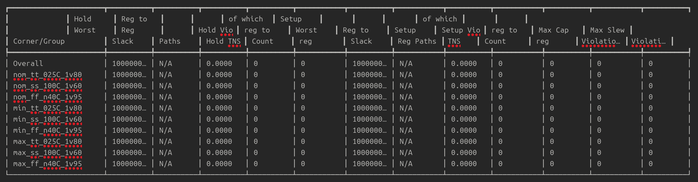
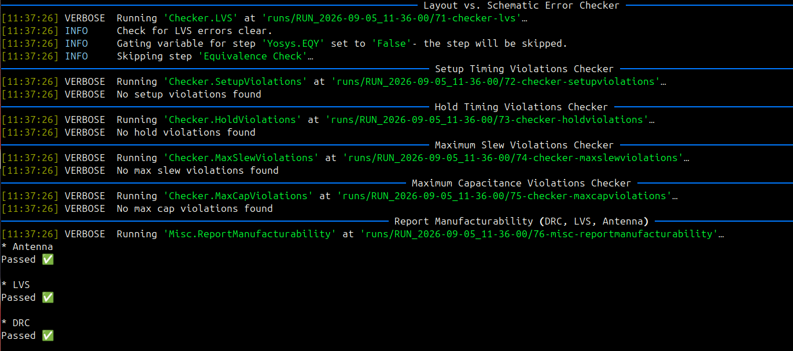
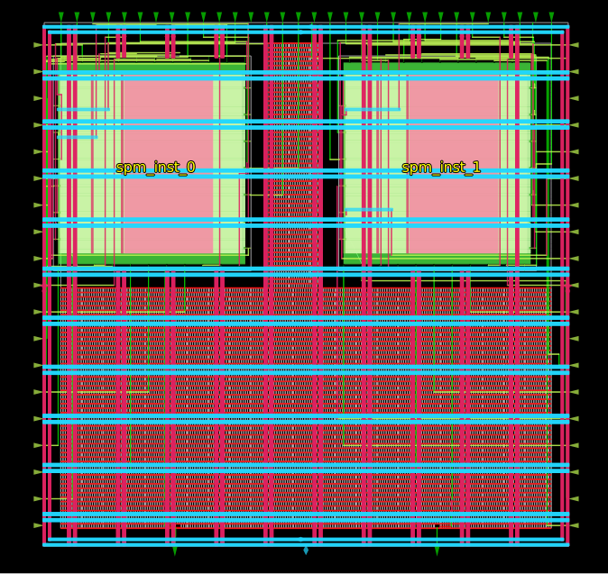
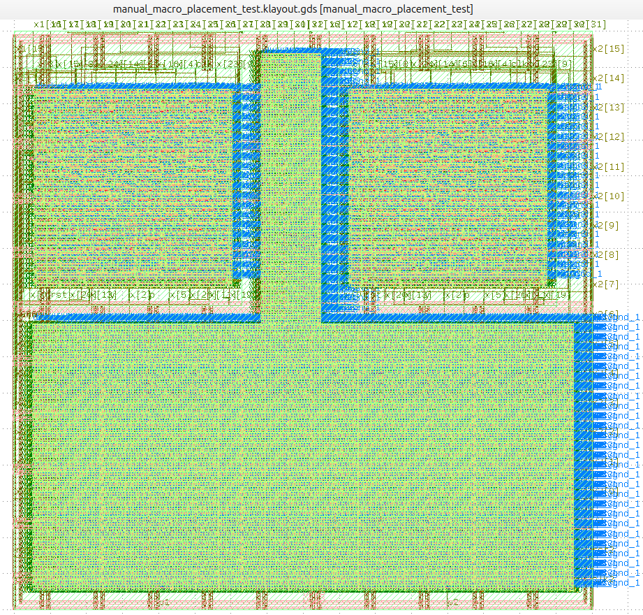

# Manual Macro Placement & Physical Implementation Flow (SkyWater 130nm)

This repository demonstrates the hierarchical physical design flow and manual macro placement implementation of a multi-macro SoC subsystem (**manual_macro_placement_test**) targeting the open-source **SkyWater 130nm (sky130_fd_sc_hd)** process design kit using the OpenLane / LibreLane ASIC flow.

---

## Overview
The design instantiates two identical, hard-macro instances of a 32-bit **Serial-Parallel Multiplier (`spm`)** within a custom-sized core floorplan. The top-level integrates pre-hardened abstract views (LEF) and physical layouts (GDSII) of `spm`, executing a complete RTL-to-GDSII sign-off flow covering macro integration, custom power distribution networking (PDN), timing closure across dual clock domains, and DRC/LVS physical verification.

---

## Architecture & Design Details
- **Top-Level Module:** `manual_macro_placement_test`
- **Instantiated Macros:**
  - `spm_inst_0`: 32-bit Serial-Parallel Multiplier (Domain 1)
  - `spm_inst_1`: 32-bit Serial-Parallel Multiplier (Domain 2)
- **Clock Domains:** Independent clock trees for each macro domain:
  - `clk1` (Domain 1 clock)
  - `clk2` (Domain 2 clock)
- **Target Technology:** SkyWater 130nm (`sky130_fd_sc_hd`)
- **Die Area:** $330\,\mu\text{m} \times 330\,\mu\text{m}$ (Absolute sizing: `[0, 0, 330, 330]`)
- **Core Area:** $310\,\mu\text{m} \times 310\,\mu\text{m}$ (Bounding box: `[10, 10, 320, 320]`)
- **Core Ring & PDN Grid:**
  - Vertical Pitch / Width: $30\,\mu\text{m}$ / $2\,\mu\text{m}$
  - Horizontal Pitch / Width: $30\,\mu\text{m}$ / $2\,\mu\text{m}$
  - Target Placement Density: `0.80` (80%)

---

## Pin Assignment & Configuration
To minimize routing congestion and wirelength to the respective hard macros, peripheral I/O pins are strategically constrained across chip boundaries via `pin_order.cfg`:

| Chip Boundary | Assigned Signals | Function |
|:---|:---|:---|
| **WEST** | `clk1`, `rst1`, `y1`, `x1[15:0]` | Domain 1 Controls & Lower Data Bits (Macro 0) |
| **EAST** | `clk2`, `rst2`, `y2`, `x2[15:0]` | Domain 2 Controls & Lower Data Bits (Macro 1) |
| **NORTH** | `x1[31:16]`, `x2[31:16]` | Upper Data Vector Bits for both instances |
| **SOUTH** | `p1`, `p2` | Serial Product Output bits |

---

## Macro Placement Strategy
The two SPM macros (`spm_inst_0` and `spm_inst_1`) each measure approximately $120.68\,\mu\text{m} \times 131.40\,\mu\text{m}$. They are placed symmetrically side-by-side using fixed coordinates defined in `macro_placement.cfg` with standard North (`N`) orientation:

spm_inst_0 15 15 N
spm_inst_1 184 15 N


This leaves an optimized vertical channel between the macros for PDN straps, power rings, and inter-block signal routing.

---

## Static Timing Analysis (STA)
The design operates across two synchronous clock domains constrained at **10.0 ns (100 MHz)**. Multi-corner sign-off timing analysis confirms **zero setup/hold violations** across all operating corners (typical, slow, fast):

Corner/Group	Hold Worst Slack	Hold TNS	Setup Worst Slack	Setup TNS	Max Slew Vio	Max Cap Vio
Overall	1000000.00 ps	0.0000	1000000.00 ps	0.0000	0	0
nom_tt_025C_1v80	1000000.00 ps	0.0000	1000000.00 ps	0.0000	0	0
nom_ss_100C_1v60	1000000.00 ps	0.0000	1000000.00 ps	0.0000	0	0
nom_ff_n40C_1v95	1000000.00 ps	0.0000	1000000.00 ps	0.0000	0	0




---

## Physical Verification & Sign-off
Automated checks for Antenna, LVS (Layout vs. Schematic), and DRC (Design Rule Checking) passed cleanly without any manufacturing or connectivity issues:

- **Antenna Rules:** Passed (0 violations)
- **LVS Check:** Passed (Netlist matches layout schematics cleanly)
- **DRC Check:** Passed (Magic & KLayout DRC clean)



---

## Layout Views & Results

### 1. OpenROAD GUI Floorplan & Routing
Floorplan visualization depicting power straps, macro orientation, standard cell placement, and detailed routing:



### 2. Final KLayout GDSII Layout
High-resolution full-chip GDSII stream-out rendered in KLayout showing standard cell rows, multi-metal routing (met1–met4), and the two placed SPM macros:



---

## Directory Hierarchy
```plaintext
├── config.yaml               # Flow, floorplan, PDN and placement configurations
├── macro_placement.cfg       # Manual coordinate placement for hard macros
├── pin_order.cfg             # Perimeter pin assignment constraints
├── images/                   # Screenshots and sign-off report captures
│   ├── DRC_LVS_CHECKS.png
│   ├── KlayoutGDS.png
│   ├── OpenGui.png
│   └── STA.png
└── src/
    ├── design.v              # Top-level RTL instantiation module
    ├── impl.sdc              # Implementation timing constraints
    ├── signoff.sdc           # Sign-off timing constraints
    ├── spm.gds               # Macro physical GDSII layout view
    ├── spm.lef               # Macro abstract LEF view
    └── spm_tb.v              # SPM functional verification testbench
```
---

## Highlights

**RTL Design → Behavioral Verification → Yosys Synthesis → Floorplanning/PDN → Placement → CTS → Routing → STA → DRC/LVS → GDSII**

This project demonstrates an end-to-end **ASIC physical-design workflow** for a sequential arithmetic datapath, covering the transition from synthesizable Verilog RTL to a physically implemented and verified **GDSII layout** using an open-source EDA flow.

---

## 👨‍💻 Author

**Ali Irfan**

*Computer Systems Engineering | Digital IC Design & Verification*

* **Focus Areas:** RTL Design, On-Chip Bus Interconnects, AMBA Protocols, SystemVerilog Verification, FPGA Prototyping, and Open-Source ASIC Physical Design Flows.
* **Core Technical Stack:** Verilog HDL, SystemVerilog, QuestaSim, LibreLane/OpenROAD, SkyWater 130nm PDK, KLayout, C++, and Linux EDA Environments.
* **Engineering Interests:** Digital IC Architecture, SoC Interconnects, Memory Systems, Processor Design, Functional Verification, and RTL-to-GDSII Implementation.

🧠 *This portfolio represents hands-on engineering work, continuous learning, and practical exploration of industry-relevant digital hardware design and verification workflows.*

