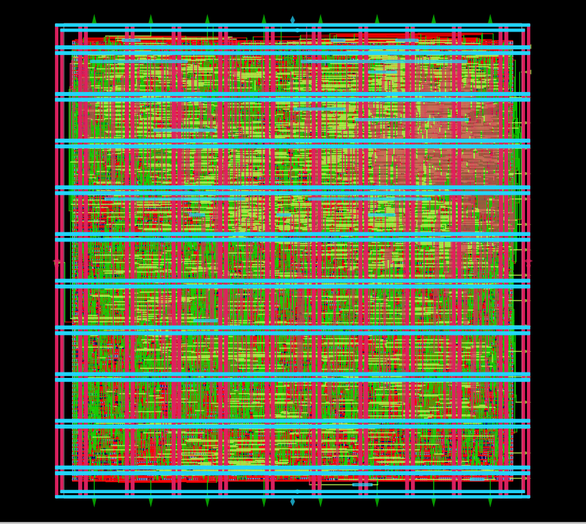
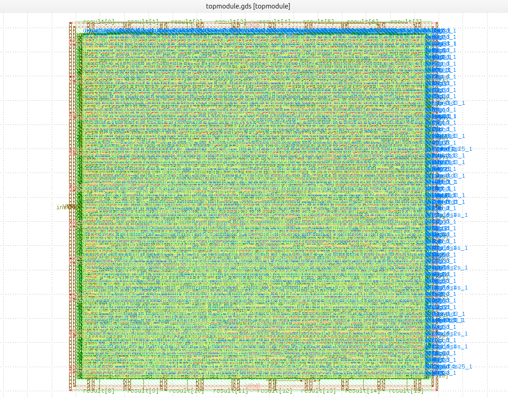

# 32-bit Single-Cycle RISC-V Core — RTL to GDSII Flow

An open-source ASIC physical design implementation of a **32-bit Single-Cycle RISC-V processor** using the **SkyWater 130nm (`sky130_fd_sc_hd`)** process node on the **LibreLane / OpenLane** automated physical design flow.

The implementation meets **multi-mode/multi-corner (MMC) signoff criteria** with high core density, clean DRC/LVS physical verification, and optimized operating frequency.

---

## 1. Design Overview

The design implements an **RV32I-based single-cycle microprocessor architecture** consisting of the following custom synthesizable Verilog modules:

| Module                         | Description                                                                                                                    |
| ------------------------------ | ------------------------------------------------------------------------------------------------------------------------------ |
| `TOPMODULE.v`                  | Top-level integration uniting the datapath, control unit, program counter, and memory interfaces.                              |
| `ALU.v`                        | Arithmetic and Logic Unit executing core integer operations, shifts, comparisons, and branch evaluations.                      |
| `CONTROL_UNIT.v`               | Instruction decoder generating control lines such as ALU operations, branch flags, register write enables, and memory enables. |
| `PC.v`                         | Program counter update logic for sequential increment and branch/jump targets.                                                 |
| `REGISTER_FILE.v`              | 32-bit integer register array with dual-read and single-write ports.                                                           |
| `DATA_MEM.v` / `WRAPPER_MEM.v` | Synchronous data memory interface and read/write subsystem.                                                                    |
| `INSTR_MEM.v`                  | Instruction memory holding the firmware binary vector (`instr.mem`).                                                           |

---

## 2. Synthesis Strategy & Optimization Trade-offs

To achieve timing closure without ballooning silicon area, synthesis strategy selection (`SYNTH_STRATEGY`) plays a critical role during the logic mapping phase in Yosys:

| Strategy Mode | Logic Mapping Focus | Delay Impact | Area Impact | Design Suitability |
| :--- | :--- | :--- | :--- | :--- |
| **`AREA 0` - `AREA 2`** | Aggressive gate footprint minimization | High data-path delay; bypasses heavy sizing/buffering | Minimal cell count & lowest gate area | Low-frequency / area-constrained controllers |
| **`DELAY 0`** *(Selected)* | Timing-driven restructuring & gate sizing | Shortest critical paths; enables optimal slew/setup margins | Balanced instance footprint with relative sizing | High-performance / clock-constrained datapaths |

### Strategy Rationale
* **Timing Closure vs Area Trade-off:** While `AREA` strategies yield smaller initial cell counts, they introduce substantial propagation delays across deep combinational paths (such as the ALU carry chains and register file muxing). This causes severe setup violations ($-\text{WNS}$) that downstream physical placement cannot easily recover.
* **Selected Mode (`DELAY 0`):** Prioritizes datapath timing optimization during synthesis mapping. Combined with timing-driven global placement (`PL_TIMING_DRIVEN: true`), it guarantees positive setup slack across nominal and fast corners while maintaining a compact **58.1% core utilization** footprint[cite: 1].

---
## 3. Key Physical Design & Signoff Metrics

| Metric Category     | Parameter / Signoff Check                | Achieved Result                                |
| ------------------- | ---------------------------------------- | ---------------------------------------------- |
| Technology Node     | Process Design Kit (PDK)                 | SkyWater 130nm (`sky130_fd_sc_hd`)             |
| Synthesis Strategy  | Yosys Logic Optimization Mode            | `DELAY 0` (Timing-Driven)                      |
| Silicon Area        | Standard Cell Instances                  | 4,206 cells                                    |
| Silicon Area        | Core Area                                | 80,026.75 µm² (0.0800 mm²)                     |
| Silicon Area        | Die Area                                 | 89,707.46 µm² (0.0897 mm²)                     |
| Silicon Area        | Die Dimensions                           | 294.20 µm × 304.92 µm                          |
| Density             | Core Utilization (`FP_CORE_UTIL`)        | 58.1%                                          |
| Timing Signoff      | Clock Period Target                      | 12.0 ns                                        |
| Timing Signoff      | Max Operating Frequency — Worst Corner   | ~71.5 MHz (`nom_ss_100C_1v60`)                 |
| Timing Signoff      | Max Operating Frequency — Typical Corner | >120 MHz (`nom_tt_025C_1v80`, Slack: +3.68 ns) |
| Timing Signoff      | Hold Violations                          | 0 violations (All corners clean)               |
| Timing Signoff      | Max Slew / Max Cap Violations            | 0 violations across all corners                |
| Physical DRC        | Magic DRC Signoff                        | Clean (0 errors)                               |
| Layout vs Schematic | Netgen LVS Signoff                       | Clean (Netlists match uniquely)                |
| Antenna Check       | Antenna Diode / Ratio Checker            | Clean (0 violations)                           |

---

## 4. Multi-Mode Multi-Corner (MMC) Timing Summary

Multi-corner static timing analysis (STA) was executed post-PnR using `OpenROAD.STAPostPNR` across all primary operating process corners.

| Timing Corner      | Hold Slack (WNS) | Hold Violations | Setup Slack (WNS) | Max Slew / Cap Vio |
| ------------------ | ---------------: | --------------: | ----------------: | -----------------: |
| `nom_tt_025C_1v80` |       +0.2588 ns |               0 |        +3.6879 ns |              0 / 0 |
| `nom_ff_n40C_1v95` |       +0.2607 ns |               0 |        +5.8660 ns |              0 / 0 |
| `nom_ss_100C_1v60` |       +0.5903 ns |               0 |        -1.9400 ns |              0 / 0 |
| `min_tt_025C_1v80` |       +0.4789 ns |               0 |        +3.8635 ns |              0 / 0 |
| `min_ff_n40C_1v95` |       +0.2588 ns |               0 |        +5.9799 ns |              0 / 0 |
| `min_ss_100C_1v60` |       +0.6484 ns |               0 |        -1.5882 ns |              0 / 0 |
| `max_tt_025C_1v80` |       +0.4904 ns |               0 |        +3.4989 ns |              0 / 0 |
| `max_ff_n40C_1v95` |       +0.2611 ns |               0 |        +5.7416 ns |              0 / 0 |
| `max_ss_100C_1v60` |       +0.5185 ns |               0 |        -2.3079 ns |              0 / 0 |

> **Note:** The slow-slow (`ss`) corners show negative setup slack at the 12.0 ns target, while hold, slew, and capacitance checks remain clean.

---

## 5. Physical Layout (GDSII View)

The physical implementation was generated through the LibreLane/OpenLane flow using the SkyWater 130nm standard-cell library. The final layout was exported to **GDSII** and inspected using **KLayout**.

### OpenROAD — Placed & Routed Layout

<p align="center">
  
</p>

<p align="center">
  <i>Placed and routed design viewed in OpenROAD using the OpenDB (.odb) database.</i>
</p>

### KLayout — Final GDSII Layout

<p align="center">
  
</p>

<p align="center">
  <i>Final GDSII layout opened and inspected in KLayout after physical design completion.</i>
</p>


---

## 6. Directory Structure

```text
.
├── config.yaml              # LibreLane PnR & flow configuration
├── pin_order.cfg            # Top-level boundary IO pin placement order
├── PDN_Rounting.png       # OpenROAD ODB placed & routed layout
├── GDSII.png     # Final GDSII layout viewed in KLayout
├── src/                     # Design source files & constraints
│   ├── ALU.v
│   ├── CONTROL_UNIT.v
│   ├── DATA_MEM.v
│   ├── INSTR_MEM.v
│   ├── PC.v
│   ├── REGISTER_FILE.v
│   ├── TOPMODULE.v
│   ├── WRAPPER_MEM.v
│   ├── instr.mem
│   ├── impl.sdc
│   └── signoff.sdc
├── verify/                  # Functional verification & simulation benches
└── README.md
```

