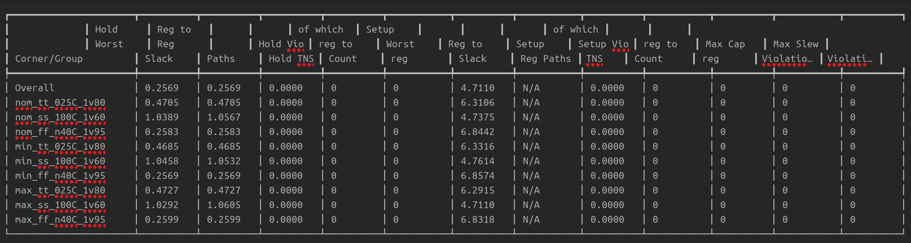
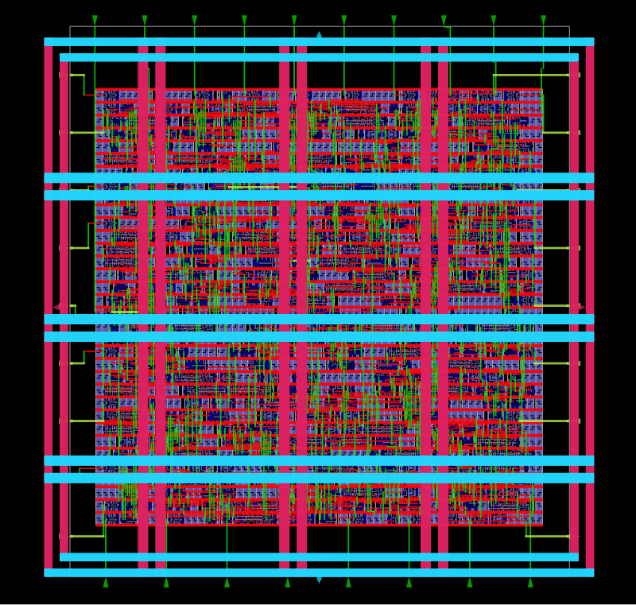
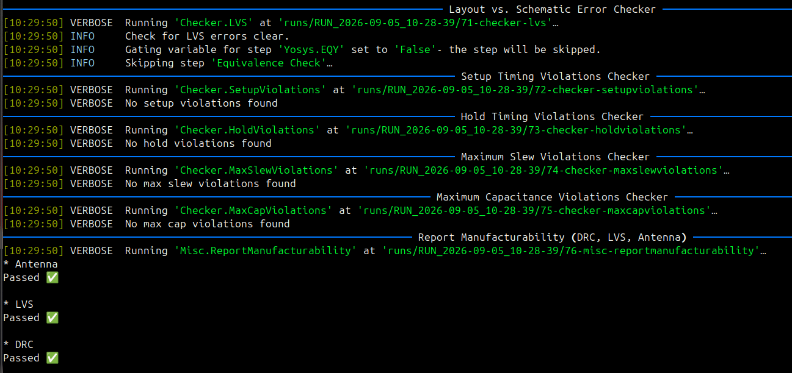
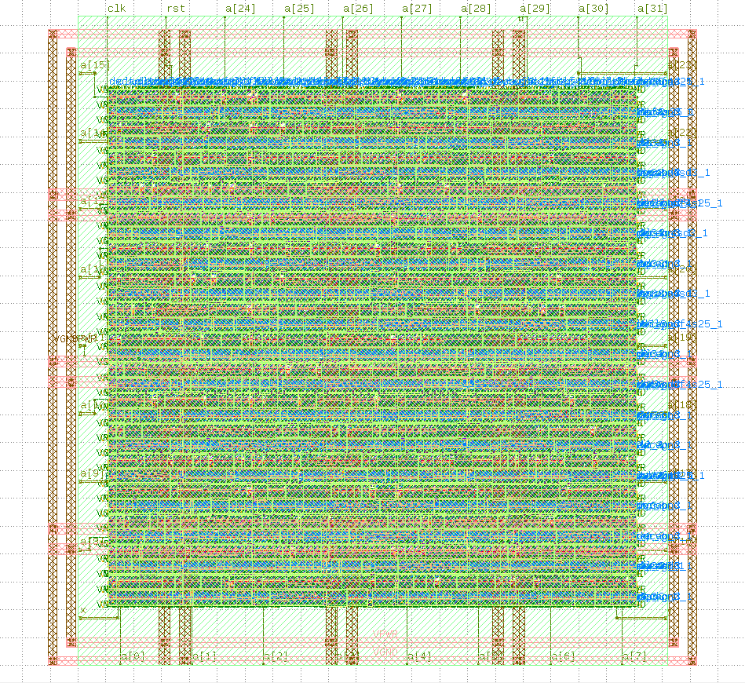

# 32-bit Serial-Parallel Multiplier (SPM)


A synthesizable **32-bit Serial-Parallel Multiplier (SPM)** implemented in Verilog and taken through a complete **ASIC RTL-to-GDSII physical design flow** using the open-source **SkyWater 130nm PDK** and **LibreLane/OpenROAD**.

The design implements serial multiplication using sequential shift-and-add operations, reducing hardware complexity compared with a fully parallel multiplier. The project covers **RTL design, behavioral simulation, synthesis, floorplanning, placement, clock tree synthesis, routing, static timing analysis, physical verification, and final GDSII generation**.

---

## Architecture

The design implements a **32-bit Serial-Parallel Multiplier**, where one operand is processed serially while the other operand is maintained in parallel.

The multiplier performs the multiplication through sequential **shift-and-add operations** controlled by a finite-state/sequential control structure.

### Main Operations

* Load the input operands.
* Examine the current multiplier bit.
* Add the multiplicand to the partial product when required.
* Shift the operands for the next multiplication cycle.
* Repeat the operation for all 32 multiplier bits.
* Produce the final multiplication result.

The serial approach reduces the amount of combinational hardware required while performing multiplication over multiple clock cycles.

### Basic Architecture

```text
                 ┌──────────────────┐
                 │   Control Logic   │
                 │  / Sequencing     │
                 └────────┬─────────┘
                          │
                          ▼
        ┌──────────┐   ┌──────────────┐
        │Multiplier│──►│ Shift / Test │
        │  Operand │   └──────┬───────┘
        └──────────┘          │
                              ▼
                       ┌─────────────┐
                       │    Adder    │
                       └──────┬──────┘
                              │
                              ▼
                       ┌─────────────┐
                       │Accumulator /│
                       │Partial Prod.│
                       └──────┬──────┘
                              │
                         Shift / Repeat
                              │
                              ▼
                       Final Product
```

---

## RTL Functional Verification

The multiplier RTL was developed in synthesizable **Verilog HDL** and functionally verified using a dedicated testbench.

The testbench applies input operands to the multiplier and verifies that the generated product matches the expected multiplication result.

Behavioral simulation was used to observe:

* Operand loading
* Sequential multiplication operation
* Partial-product accumulation
* Shift operations
* Control sequencing
* Final product generation

The verification environment is provided in:

```text
TB/
└── spm_tb.v
```

The main RTL implementation is:

```text
RTL/
└── spm.v
```

---

## ASIC Implementation — RTL to GDSII

The verified synthesizable RTL was taken through a complete ASIC physical-design flow using **LibreLane**, targeting the **SkyWater 130nm `sky130_fd_sc_hd`** standard-cell library.

```text
Verilog RTL
    │
    ▼
Yosys Synthesis
    │
    ▼
Floorplanning / PDN
    │
    ▼
Placement
    │
    ▼
Clock Tree Synthesis
    │
    ▼
Routing
    │
    ▼
Static Timing Analysis
    │
    ▼
DRC / LVS / Antenna Checks
    │
    ▼
GDSII
```

The physical implementation was configured through the ASIC flow configuration and pin-placement files:

```text
ASIC/
├── config.yaml
└── pin_order.cfg
```

## Timing Analysis

Static Timing Analysis was performed on the completed physical implementation using the project timing constraints.



The SDC files define the timing environment for both implementation and signoff:

```text
impl.sdc
signoff.sdc
```

---

## OpenROAD Physical Layout

After synthesis, floorplanning, placement, CTS, and routing, the resulting physical design was inspected using **OpenROAD/OpenLane-compatible layout tools**.

The layout view demonstrates the implemented standard-cell design, power distribution, routing, and overall ASIC floorplan.



---

## Timing Analysis

Static Timing Analysis was performed on the completed physical implementation using the project timing constraints.

The SDC files define the timing environment for both implementation and signoff:

```text
impl.sdc
signoff.sdc
```

The timing analysis was used to verify that the implemented design satisfies the required clock constraints and does not contain critical setup or hold timing violations.

---

## Physical Verification & Signoff

The final ASIC implementation was subjected to physical verification checks before GDSII generation.

The signoff stage includes checks such as:

* **Design Rule Check (DRC)**
* **Layout Versus Schematic (LVS)**
* **Antenna verification**
* Physical implementation consistency
* Final layout validation

The verification results are summarized in the following project image:



---

## Final GDSII

The completed ASIC layout was exported as **GDSII**, representing the final physical implementation of the 32-bit Serial-Parallel Multiplier.

The generated layout was inspected using **KLayout** to verify the final chip geometry and physical layers.



---

## Tools & Technologies

| Category          | Tools / Technologies   |
| ----------------- | ---------------------- |
| RTL               | Verilog HDL            |
| Simulation        | Verilog Testbench      |
| ASIC Technology   | SkyWater 130nm         |
| Standard Cells    | `sky130_fd_sc_hd`      |
| Synthesis         | Yosys                  |
| Physical Design   | LibreLane / OpenROAD   |
| Timing            | Static Timing Analysis |
| DRC               | Magic VLSI             |
| LVS               | Netgen                 |
| Layout Inspection | KLayout                |
| Constraints       | SDC                    |
| Output            | GDSII                  |

---

## Repository Structure

```text
SPM/
├── ASIC/
│   ├── config.yaml
│   └── pin_order.cfg
├── PICS/
│   ├── DRV_LVS_CHECKS.png
│   ├── KlayoutGDS.png
│   ├── STA.png
│   └── Opengui.png
├── RTL/
│   ├── impl.sdc
│   ├── signoff.sdc
│   └── spm.v
├── TB/
│   └── spm_tb.v
└── README.md
```

---

## Highlights

**RTL Design → Behavioral Verification → Yosys Synthesis → Floorplanning/PDN → Placement → CTS → Routing → STA → DRC/LVS → GDSII**

This project demonstrates an end-to-end **ASIC physical-design workflow** for a sequential arithmetic datapath, covering the transition from synthesizable Verilog RTL to a physically implemented and verified **GDSII layout** using an open-source EDA flow.

---

## 👨‍💻 Author

**Ali Irfan**

*Computer Systems Engineering | Digital IC Design & Verification*

* **Focus Areas:** RTL Design, On-Chip Bus Interconnects, AMBA Protocols, SystemVerilog Verification, FPGA Prototyping, and Open-Source ASIC Physical Design Flows.
* **Core Technical Stack:** Verilog HDL, SystemVerilog, QuestaSim, LibreLane/OpenROAD, SkyWater 130nm PDK, KLayout, C++, and Linux EDA Environments.
* **Engineering Interests:** Digital IC Architecture, SoC Interconnects, Memory Systems, Processor Design, Functional Verification, and RTL-to-GDSII Implementation.

🧠 *This portfolio represents hands-on engineering work, continuous learning, and practical exploration of industry-relevant digital hardware design and verification workflows.*

⭐ *If you find this implementation useful, feel free to give the repository a star!*

