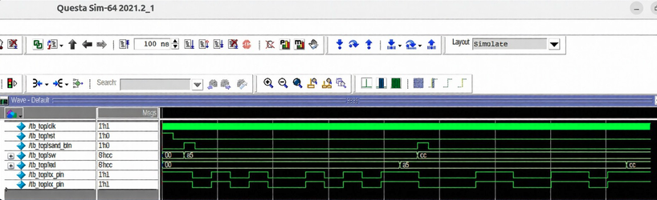
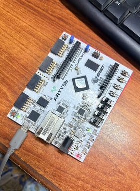
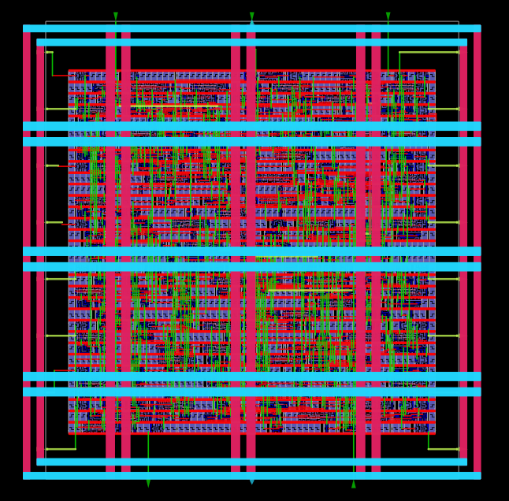
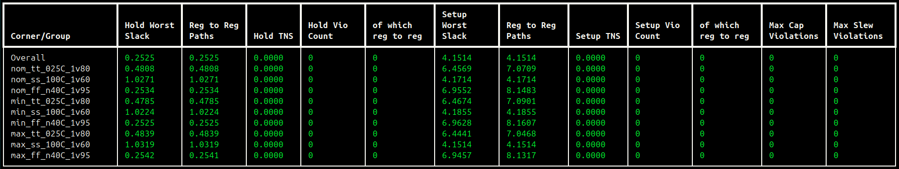
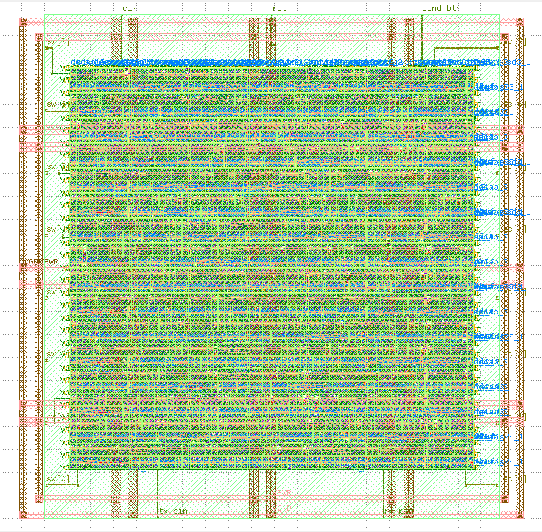

# UART Controller with Parity Verification & Baud Rate Generator


A complete **UART Controller** implemented in synthesizable Verilog and taken through the full digital IC design flow — from **RTL development and behavioral simulation to FPGA prototyping, ASIC physical implementation, timing analysis, and final GDSII**.

The design targets **9600 baud UART communication** with **8-bit data and even parity verification**, using the **Digilent Arty A7-100T** for FPGA validation and **SkyWater 130nm `sky130_fd_sc_hd`** for ASIC implementation.

---

## Architecture

The design consists of three main RTL modules:

* **`baud_gen.v`** — Generates UART timing ticks from the system clock using a 10416-cycle counter.
* **`master_tx.v`** — Serializes 8-bit parallel data, generates even parity, and transmits the UART frame.
* **`slave_rx.v`** — Receives and deserializes the UART stream, verifies parity, and outputs the received data.
* **`top_module.v`** — Top-level wrapper connecting the complete UART system.

### UART Frame

```text
       Start       8-bit Data        Parity     Stop
         |       LSB -------- MSB       |         |
         v                              v         v
... |  0  |  D0 | D1 | D2 | D3 | D4 | D5 | D6 | D7 |  P  |  1  | ...
```


---

## RTL Functional Verification

The design was behaviorally verified using **QuestaSim**. The testbench verifies UART transmission, serial data reception, parity generation/checking, and correct data latching.

Representative test vectors include `0xA5` and `0xCC`.



---

## FPGA Prototyping

The verified RTL was synthesized and tested on the **Digilent Arty A7-100T (AMD/Xilinx Artix-7)**.

| Signal     | Function             |
| ---------- | -------------------- |
| `sw[7:0]`  | 8-bit transmit data  |
| `send_btn` | Transmission trigger |
| `tx_pin`   | UART transmit        |
| `rx_pin`   | UART receive         |
| `led[7:0]` | Received data        |
| `clk`      | System clock         |
| `rst`      | Reset                |

The FPGA implementation was validated using the board switches, LEDs, and UART interface.



---

## ASIC Implementation — RTL to GDSII

The same synthesizable RTL was taken through a complete ASIC physical-design flow using **LibreLane**, targeting the **SkyWater 130nm `sky130_fd_sc_hd`** standard-cell library.

```text
Verilog RTL
    │
    ▼
Yosys Synthesis
    │
    ▼
Floorplanning
    │
    ▼
Placement
    │
    ▼
Clock Tree Synthesis
    │
    ▼
Routing
    │
    ▼
Static Timing Analysis
    │
    ▼
DRC / LVS / Antenna
    │
    ▼
GDSII
```

### Physical Configuration

* Target clock: **100 MHz**
* Clock period: **10.0 ns**
* Core utilization: approximately **45–50%**
* Symmetric **3×3 PDN**
* Core power ring enabled
* Standard-cell clock buffers used during CTS

The I/O pin arrangement was defined using `pin_order.cfg`:

```text
North : clk, rst, send_btn
South : tx_pin, rx_pin
West  : sw.*
East  : led.*
```

### OpenROAD Physical Layout



---

## Timing & Signoff

Static Timing Analysis was performed across **9 PVT corners** with a **10 ns clock target**.

* Setup violations: **0**
* Hold violations: **0**
* Positive timing slack across the analyzed corners



The final physical implementation was also verified through standard physical signoff checks before GDSII generation.

---

## Final GDSII

The completed ASIC layout was exported as **GDSII** and inspected in **KLayout**, providing the final physical representation of the implemented UART design.



---

## Tools & Technologies

| Category        | Tools / Technologies            |
| --------------- | ------------------------------- |
| RTL             | Verilog HDL                     |
| Simulation      | QuestaSim                       |
| FPGA            | Digilent Arty A7-100T / Artix-7 |
| ASIC Technology | SkyWater 130nm                  |
| Standard Cells  | `sky130_fd_sc_hd`               |
| Synthesis       | Yosys                           |
| Physical Design | LibreLane / OpenROAD            |
| Timing          | Static Timing Analysis          |
| DRC             | Magic VLSI                      |
| LVS             | Netgen                          |
| Layout          | KLayout                         |
| Output          | GDSII                           |

---

## Repository Structure

```text
UART-Controller/
├── rtl/
│   ├── top_module.v
│   ├── baud_gen.v
│   ├── master_tx.v
│   └── slave_rx.v
├── tb/
│   ├── tb_top_module.v
├── fpga/
│   ├── Makefile
│   ├── flow.json
│   ├── arty.xdc
├── asic/
│   ├── config.yaml
│   └── pin_order.cfg
├── Schematic.jpg
├── waveform.png
├── ArtyA7.png
├── opengui.jpg
├── klayoutgds.png
├── sta.png
└── README.md
```

---

## Highlights

**RTL Design → QuestaSim Verification → FPGA Prototyping → ASIC Physical Design → STA → Physical Signoff → GDSII**

This project demonstrates an end-to-end workflow for **Digital IC Design, RTL Development, FPGA Prototyping, and ASIC Physical Implementation**.

---

## 👨‍💻 Author

**Ali Irfan**

*Computer Systems Engineering | Digital IC Design & Verification*

* **Focus Areas:** RTL Design, On-Chip Bus Interconnects, AMBA Protocols, SystemVerilog Verification, FPGA Prototyping, and Open-Source ASIC Physical Design Flows.
* **Core Technical Stack:** Verilog HDL, SystemVerilog, QuestaSim, LibreLane/OpenROAD, SkyWater 130nm PDK, KLayout, C++, and Linux EDA Environments.
* **Engineering Interests:** Digital IC Architecture, SoC Interconnects, Memory Systems, Processor Design, Functional Verification, and RTL-to-GDSII Implementation.

🧠 *This portfolio represents hands-on engineering work, continuous learning, and practical exploration of industry-relevant digital hardware design and verification workflows.*

⭐ *If you find these implementations useful, feel free to give the repository a star!*

